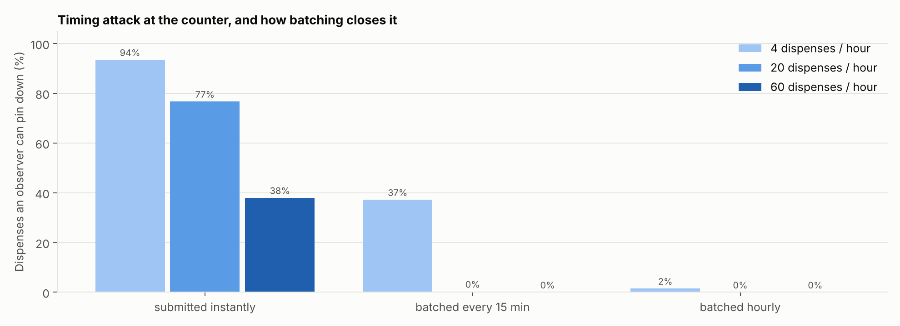
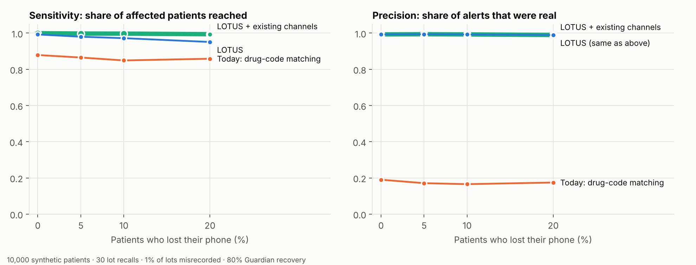
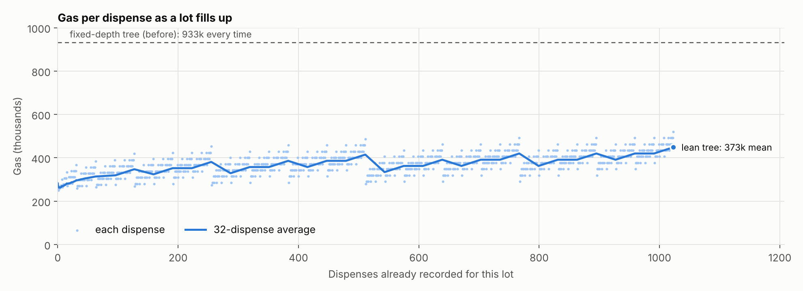

# LOTUS: Lot-Oriented Traceability for Unlinkable Subjects

**A decentralised application for lot-level drug dispensing records and privacy-preserving patient recall notification**

Manipal Institute of Technology — Blockchain project report (D7)

Patoju Sai Avinash · Adabala Venkata Abhinav · K. Jaideep Varma · Dhruti P Shetty · Ashmith C Shettigar ·
P Pattabhi Ram · Puripanda Venkata Praneeth · K. Poorna Sai Praneeth

---

## Abstract

Drug recalls are issued for a specific manufacturing lot, but the final hop of the supply chain, from
pharmacy to patient, leaves no machine-verifiable record of which lot a patient received. Recall
notification therefore falls back on drug-code (NDC) matching, which alerts every patient who received
any lot of the drug and still misses patients without a linked record. LOTUS records that last hop on an
EVM blockchain as a *split record*: the lot, pharmacy pseudonym and region are public, while the patient
appears only as a Poseidon commitment derived from a secret held on their phone. Smart contracts enforce
two-sided custody and *Dispense Closure* (no pharmacy can dispense more of a lot than it received), so
records cannot be fabricated. When a lot is recalled, each patient's phone recomputes its own
commitments and self-identifies, with no matching service learning who is affected. Zero-knowledge
membership proofs let affected patients anonymously acknowledge recalls and file sybil-resistant
adverse-event reports, giving regulators a live recall-effectiveness figure and an early-warning
signal. On a 100,000-patient synthetic cohort, LOTUS raises notification precision from 0.17 (NDC
matching) to 0.99, and, run alongside existing recall channels, reaches ≥ 0.993 sensitivity under 20%
lost phones and 2% misrecorded lots, versus 0.85–0.88 for NDC matching.

## 1. Introduction

Pharmaceutical traceability systems (for example under the US Drug Supply Chain Security Act) follow a
product from manufacturer to distributor to pharmacy and stop there. The pharmacy-to-patient hop is
recorded, if at all, in pharmacy software as a drug code, not a lot number. Three problems follow:

1. **Mass false positives.** Everyone who took the drug is alarmed, from any lot.
2. **Under-notification.** Cash sales, transferred prescriptions and fragmented health records mean some
   real recipients have no linked record.
3. **No verifiable recall scope.** Nobody can prove how many units of a recalled lot left a pharmacy.

The problem is especially relevant in India, where contaminated syrups have caused deaths and where
QR codes are now mandatory on the packs of top-selling brands, making lot-level scanning at the
counter practical.

**Contributions.**
- A split-record dispensing ledger that extends cryptographic chain of custody to the patient without
  putting patient data on-chain, with on-chain invariants I1–I5.
- Local, operator-free recall matching with 2-of-3 Guardian key recovery and deterministic nonce
  derivation so recovery restores the full history.
- Two new zero-knowledge features: anonymous verified adverse-event reporting with an automatic safety
  signal, and anonymous recall acknowledgements that measure recall effectiveness.
- An open implementation (seven contracts, a patient PWA, role dashboards, a gas-free relayer) and an
  evaluation of precision, sensitivity, gas and adversarial resistance.

## 2. Why a blockchain

- **No acceptable operator.** Pharmacies will not upload patient-linked records to a competitor-run or
  central hub; they will publish anonymous commitments and counts.
- **Invariants between mutually distrusting parties.** Closure spans distributor, pharmacy and
  regulator; a neutrally sequenced ledger enforces it without an arbiter.
- **Non-repudiation.** Dispense and recall records are what is disputed later; append-only, timestamped
  entries resist retroactive editing by anyone, including the infrastructure operator.
- **Patient-side verification.** A patient can only self-identify against public, consensus-backed
  state; a private database would require trusting its operator.
- **Graceful degradation.** LOTUS runs alongside existing recall channels, never replacing them.

## 3. Design

### 3.1 Actors and flow

Manufacturer → distributor → pharmacy custody is two-sided: the sender ships, the recipient accepts,
and only accepted units count. A prescriber issues a *permit*: a quantity balance bound to
`holderCommit = keccak256(permitSecret)` with a fresh secret per prescription. At the counter the
patient's app shows a QR containing the permit and a one-time commitment. The pharmacy calls
`dispense`, which atomically redeems the permit (I3), checks custody and closure (I1, I2), rejects
reused commitments (I4) and recalled or expired lots, and appends the commitment to the lot's Merkle
tree. A regulator recalls a lot (I5); patients' phones notice on their next check.

### 3.2 Patient cryptography

```
secret        random BN254 field element, kept on the phone (AES-GCM under a PIN-derived key)
nonce_i       = Poseidon(secret, i)
commitment_i  = Poseidon(secret, nonce_i)
nullifier     = Poseidon(secret, externalNullifier)
```

Deriving nonces from the secret fixes a gap in the original design: recovering the secret through
Guardians now restores every past commitment. The phone discovers its commitments by scanning
`i = 0, 1, 2 …` until 20 consecutive misses. Each QR display reserves a new index, so showing codes at
two counters can never collide.

### 3.3 Guardians

The secret is split 2-of-3 with Shamir secret sharing between the phone, the pharmacy of record and
either the prescriber or a family member chosen by the patient. Choosing a family member removes the
pharmacy-plus-prescriber collusion path (§6, A4).

### 3.4 Lean Merkle trees and zero-knowledge signals

Each lot's commitments form a lean incremental Poseidon Merkle tree (LeanIMT): depth grows with the
number of leaves and nodes without a sibling are carried up unhashed. The circuit
`lotus_membership.circom` (≈ 9,900 constraints, Groth16) proves that a commitment derived from the
prover's secret is a leaf under a recent root, that the nullifier is derived from the same secret, and
binds a signal hash. `AnonymousSignals` uses it for:

- **Adverse-event reports (feature A):** one per patient per lot; reaching a threshold emits
  `SafetySignal`, and the regulator can issue a recall flagged as crowd-triggered.
- **Recall acknowledgements (feature B):** one per patient per recall; the contract exposes recall
  effectiveness in basis points.

A relayer submits proofs and pays gas, so patients never need a wallet (feature D).

### 3.5 Privacy-preserving aggregates

`RecallRegistry.affectedCount` returns per-region affected units, suppressing any region with
0 < units < 5 (k-anonymity), so a rare drug in a small region cannot single out a patient (feature F).

## 4. Implementation

| Layer | Technology | Location |
|---|---|---|
| Contracts | Solidity 0.8.24, OpenZeppelin, poseidon-solidity | `contracts/contracts` |
| ZK | circom 2.1, circomlib, snarkjs Groth16 | `circuits/` |
| Client SDK | poseidon-lite, shamir-secret-sharing, ethers v6 | `sdk/` |
| Web | React 18, Vite, Tailwind, html5-qrcode, service worker | `apps/web` |
| Relayer | Node, Express | `apps/relayer` |
| Data & evaluation | Python 3, matplotlib; openFDA REST | `pipeline/` |
| Red team | Node simulations | `redteam/` |

Seven contracts: `RoleRegistry`, `BatchRegistry`, `CustodyLedger`, `PrescriptionRegistry`,
`DispenseLedger`, `RecallRegistry`, `AnonymousSignals` (+ generated `Groth16Verifier`).

The web app provides dashboards for manufacturer, distributor, prescriber, pharmacy and regulator, the
patient PWA (encrypted wallet, camera QR scanning, alerts in English, Hindi, Kannada and Telugu,
in-browser proving, Guardian handover and recovery, offline support) and a public verification page that
flags unregistered lots as possible counterfeits and shows custody path, expiry and certificate hash
(feature E). The regulator dashboard can replay openFDA enforcement events as recalls (feature G).

## 5. Verification

- **37 automated contract tests plus 3 SDK tests** (`npm test`), including access-control negative tests for every
  gated function, a 150-step randomized invariant fuzzer for I1/I3, an end-to-end scenario, and
  real-proof tests against the generated Groth16 verifier.
- **Coverage:** 100% of lines and 95% of branches in the LOTUS contracts (CI gate: branches ≥ 90%).
- **Cross-implementation checks:** the on-chain tree root equals the SDK's; the SDK's external
  nullifiers and signal hashes equal the contract's.
- **Browser end-to-end test** (`npm run test:e2e`): a fresh lot is registered, shipped, accepted,
  prescribed, scanned, batch-dispensed, recalled; the patient is alerted, acknowledges and reports with
  real proofs; the phone is "lost" and recovered from Guardian shares; a fake lot fails verification.

## 6. Security analysis

Summarised from `docs/THREAT_MODEL.md` and `redteam/REPORT.md`:

| Attack | Outcome |
|---|---|
| Link two dispenses of one patient from chain data | No signal: KS p ≈ 0.2–0.9, best classifier ≈ 51% |
| Timing correlation at the counter | 94% identifiable at a quiet pharmacy if submitted instantly; 2% with hourly batching (`dispenseBatch`) |
| Small-region inference from aggregates | 20.6% of region cells would expose ≤ 2 patients; k = 5 hides all |
| Pharmacy + prescriber pool Guardian shares | Possible with default guardians; prevented by choosing a family guardian |
| Duplicate / fake / altered reports | Rejected: nullifier reuse, missing witness, and bound signal hash (real proofs) |
| Fabricated stock or over-dispensing | Rejected by two-sided custody and closure under fuzzing |



## 7. Evaluation

**Setup.** Synthetic cohorts (built-in deterministic generator; Synthea-compatible) of 1k, 10k and 100k
patients with 1–6 dispenses each across 40 drugs × 6 lots; 15% of dispenses lack a drug-level record.
30 random lot recalls per configuration. Failures injected: lost phones (0–20%, 80% recovered by
Guardians) and misrecorded lots (0–2%). All datasets regenerate byte-for-byte (`pipeline/MANIFEST.json`).

### 7.1 Notification accuracy (10,000 patients)

| Lost phones | Misrecorded | Method | Precision | Sensitivity |
|---|---|---|---|---|
| 0% | 0% | NDC matching | 0.184 | 0.868 |
| 0% | 0% | LOTUS | **1.000** | **1.000** |
| 10% | 1% | NDC matching | 0.165 | 0.849 |
| 10% | 1% | LOTUS | 0.993 | 0.972 |
| 10% | 1% | LOTUS + existing channels | 0.993 | 0.997 |
| 20% | 1% | NDC matching | 0.174 | 0.858 |
| 20% | 1% | LOTUS | 0.989 | 0.951 |
| 20% | 1% | LOTUS + existing channels | 0.990 | 0.994 |

Across all 16 failure settings, LOTUS + existing channels never falls below 0.993 sensitivity, while
NDC matching stays between 0.849 and 0.882 and its precision never exceeds 0.20.



### 7.2 Scaling (10% lost phones, 1% misrecorded)

| Patients | Dispenses | NDC precision | LOTUS precision | LOTUS + channels sensitivity |
|---|---|---|---|---|
| 1,000 | 3,528 | 0.186 | 0.981 | 0.995 |
| 10,000 | 34,858 | 0.165 | 0.993 | 0.997 |
| 100,000 | 349,415 | 0.174 | 0.992 | 0.997 |

Patient-side cost (Node, laptop): scanning 100,000 on-chain dispenses for one's commitments takes
≈ 50 ms; rebuilding a 1,310-leaf lot tree ≈ 0.4 s; generating a Groth16 proof ≈ 1.1 s (median of 3).

### 7.3 Gas

| Operation | Gas |
|---|---|
| registerLot | 223,790 |
| ship / accept | 177,037 / 88,415 |
| issue permit | 144,792 |
| **dispense** (lot growing to 1,024 dispenses) | **mean 372,520** (min 250,090, max 520,243) |
| issueRecall | 167,481 |
| reportAdverseEvent / acknowledgeRecall (real proof) | ≈ 317,000 / ≈ 333,000 |

Replacing the fixed-depth (16) tree with a lean tree cut dispense gas from 933k to a 373k mean
(−60%), because an insert hashes only where a sibling exists.



## 8. Limitations and future work

- **Trusted setup.** The demo verifier comes from a local Powers of Tau ceremony; production must use
  the public Hermez file (supported and hash-checked by `circuits/setup.sh`) plus a multi-party phase-2.
- **Real data.** The evaluation uses synthetic cohorts and, in this build, illustrative recall samples;
  `pipeline/openfda.py` fetches real enforcement events where the network allows.
- **Timing.** Batching must be enabled at quiet pharmacies; an automatic minimum-batch policy is future work.
- **Network privacy.** Chain reads should go through a privacy-preserving RPC.
- **Background checks.** The PWA checks on open and every 30 s while open; push-based wake-ups need an
  operator-free push design.
- **Integration** with e-prescribing networks and pharmacy point-of-sale systems.

## 9. Conclusion

LOTUS shows that the last hop of the drug supply chain can be made verifiable without exposing patients.
Lot-scoped recall reaches the right patients with near-perfect precision, closure accounting makes the
records trustworthy, and zero-knowledge signals turn patients into an anonymous, sybil-resistant early
warning system, all while never leaving a patient worse off than today's recall process.

## References

1. U.S. FDA, *Drug Supply Chain Security Act (DSCSA)*, Pub. L. 113-54, Title II, 2013.
2. GS1, *EPCIS Standard*, v2.0, 2022.
3. A. Azaria et al., "MedRec: Using Blockchain for Medical Data Access and Permission Management," OBD 2016.
4. J. Walonoski et al., "Synthea," *JAMIA* 25(3), 2018.
5. U.S. FDA, *openFDA* NDC Directory and Enforcement APIs, https://open.fda.gov
6. V. Buterin, *Ethereum White Paper*, 2014.
7. A. Shamir, "How to Share a Secret," *CACM* 22(11), 1979.
8. T. P. Pedersen, "Non-Interactive and Information-Theoretic Secure Verifiable Secret Sharing," CRYPTO '91.
9. MediLedger Consortium, https://www.mediledger.com
10. Hardhat, https://hardhat.org
11. Protocol Labs, IPFS, https://ipfs.tech
12. M. Mettler, "Blockchain technology in healthcare," IEEE Healthcom 2016.
13. L. Grassi et al., "Poseidon: A New Hash Function for Zero-Knowledge Proof Systems," USENIX Security 2021.
14. J. Groth, "On the Size of Pairing-Based Non-interactive Arguments," EUROCRYPT 2016.
15. Semaphore / zk-kit LeanIMT, Privacy & Scaling Explorations, https://github.com/privacy-scaling-explorations/zk-kit
